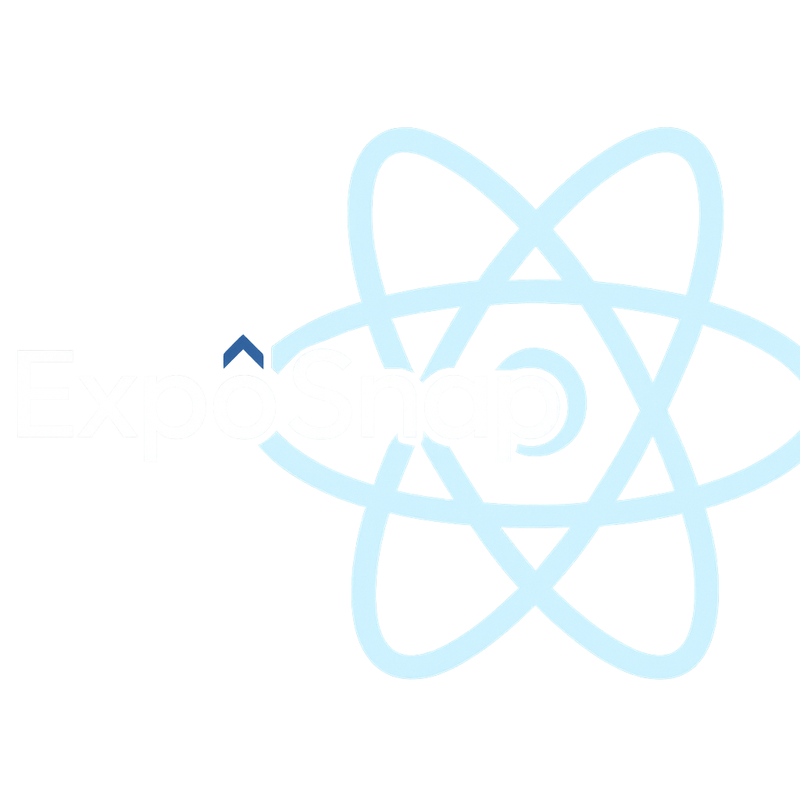

<div align="center">
  
  
  <p>
    <a href="https://github.com/edwarddjss/ExpoSnap/stargazers">
      
    </a>
    <a href="https://github.com/edwarddjss/ExpoSnap/blob/main/LICENSE">
      
    </a>
  </p>
  
  <p><em>Send screenshots from your Expo app directly to Claude.</em></p>
</div>

## What it does

Instead of manually screenshotting your Expo app and uploading images to Claude, ExpoSnap connects your app directly to Claude.

Ask Claude *"Take a screenshot"* or tap the camera button in your app - screenshots appear instantly in your conversation.

## Installation

**1. Configure your IDE**

### Claude Desktop

Add to `claude_desktop_config.json`:

```json
{
  "mcpServers": {
    "exposnap": {
      "command": "npx",
      "args": ["-y", "exposnap-mcp"]
    }
  }
}
```

### VS Code

Add to `.vscode/mcp.json` in your workspace:

```json
{
  "servers": {
    "exposnap": {
      "type": "stdio",
      "command": "npx",
      "args": ["-y", "exposnap-mcp"]
    }
  }
}
```

### Cursor

Add to your Cursor MCP configuration:

```json
{
  "mcpServers": {
    "exposnap": {
      "command": "npx",
      "args": ["-y", "exposnap-mcp"]
    }
  }
}
```

**2. Add to your Expo app**

```bash
npm install react-native-view-shot
```

```tsx
import { ScreenshotWrapper } from 'exposnap/ScreenshotWrapper';

export default function App() {
  return (
    <ScreenshotWrapper>
      <YourApp />
    </ScreenshotWrapper>
  );
}
```

**3. Start the MCP server**

```bash
npx exposnap-mcp
```

Then restart your IDE and start developing! The app automatically finds your server on the local network. If auto-discovery fails:

```tsx
<ScreenshotWrapper serverUrl="http://YOUR_COMPUTER_IP:3333">
```

## Usage

Ask Claude to take screenshots or use the camera button in your app:
- "Take a screenshot of the login screen"
- "What's wrong with this screen?"
- "How can I improve this layout?"
- "Take another screenshot"

Claude will capture and analyze your screenshots automatically.

## Troubleshooting

**Button shows "No server"**: Make sure your MCP server is running and both devices are on the same WiFi network.

**Button shows "Finding..."**: Auto-discovery is searching for your server. Wait a few seconds.

**Button doesn't work**: Check Metro logs for errors. Make sure you installed `react-native-view-shot`.

## How it works

Your Expo app sends screenshots to a local server (port 3333) on your computer. Claude connects to this server via MCP protocol to retrieve the images.

## Requirements

- Node.js 20+
- Same WiFi network for phone and computer
- Claude Desktop, Claude Code, Cursor, or VS Code with MCP support